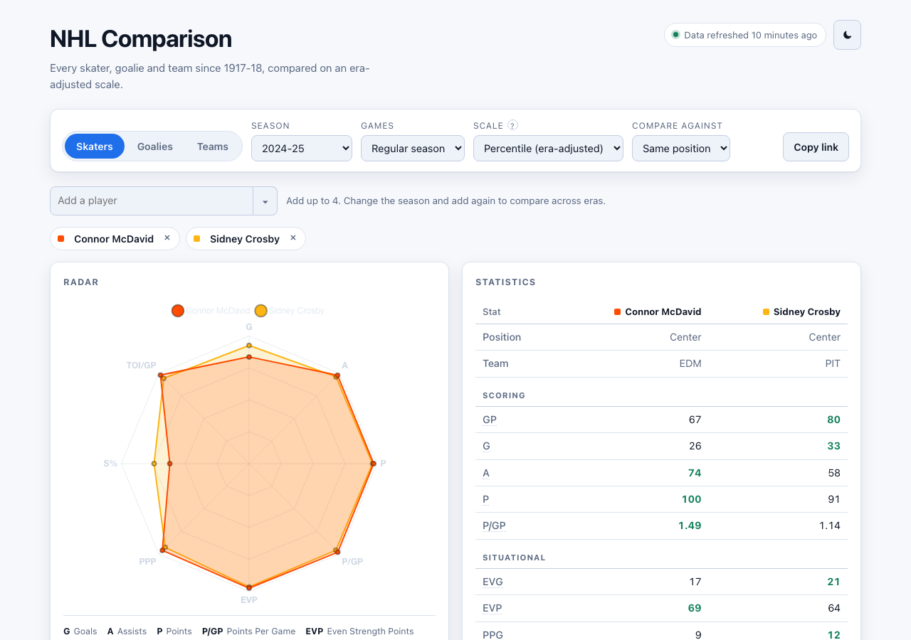

# NHL Comparison 🏒

Compare any NHL skater, goalie, or team from any season since 1917-18 on an era-adjusted radar chart and stats table.

**[View the live site →](https://nickgrichine.github.io/NHL-Stats-Comparison/)**



## Overview

This is a full-stack side project built to explore an interesting data problem: how do you fairly compare players across more than a century of NHL history, when the game itself — scoring rates, tracked stats, roster sizes — has changed dramatically?

- **Every player, every season.** All skaters, goalies, and teams back to the league's first year, not just a curated list.
- **Era-adjusted comparisons.** Each stat is shown as a percentile against the players who shared the ice with them, in that season, at that position, so a 1985 season and a 2025 season can sit on the same chart honestly.
- **Cross-era charts.** Pin different players in different seasons and compare them on one radar.
- **Regular season, playoffs, and career totals**, with a live scoreboard and standings.
- **Shareable links** — the whole comparison lives in the URL.

## Tech stack

React 19 · TypeScript · Vite · Chart.js · Vitest · GitHub Actions · GitHub Pages

## How it's built

The NHL's public stats API has no CORS headers, so it can't be called directly from a browser. Instead, a scheduled GitHub Actions workflow fetches the data server-side, publishes it as compact JSON to a `data` branch, and the site loads it same-origin — no proxy, no backend server, no API keys.

Percentiles are computed at build time per season, game type, and position group, so every comparison is ranked against the right cohort instead of a single hardcoded scale.

## Running it locally

```bash
npm install
npm run dev            # http://localhost:5173
```

The dev server needs a local dataset:

```bash
npm run data -- --out=public/data --seasons=20242025   # one season, fast
npm run data:dev                                        # full backfill, a few minutes
```

Other scripts:

```bash
npm run typecheck
npm run lint
npm test
npm run build
```

## Data

All data comes from the NHL's public stats API (`api.nhle.com`, `api-web.nhle.com`), which is free but undocumented and unofficial. This project is not affiliated with or endorsed by the National Hockey League.
