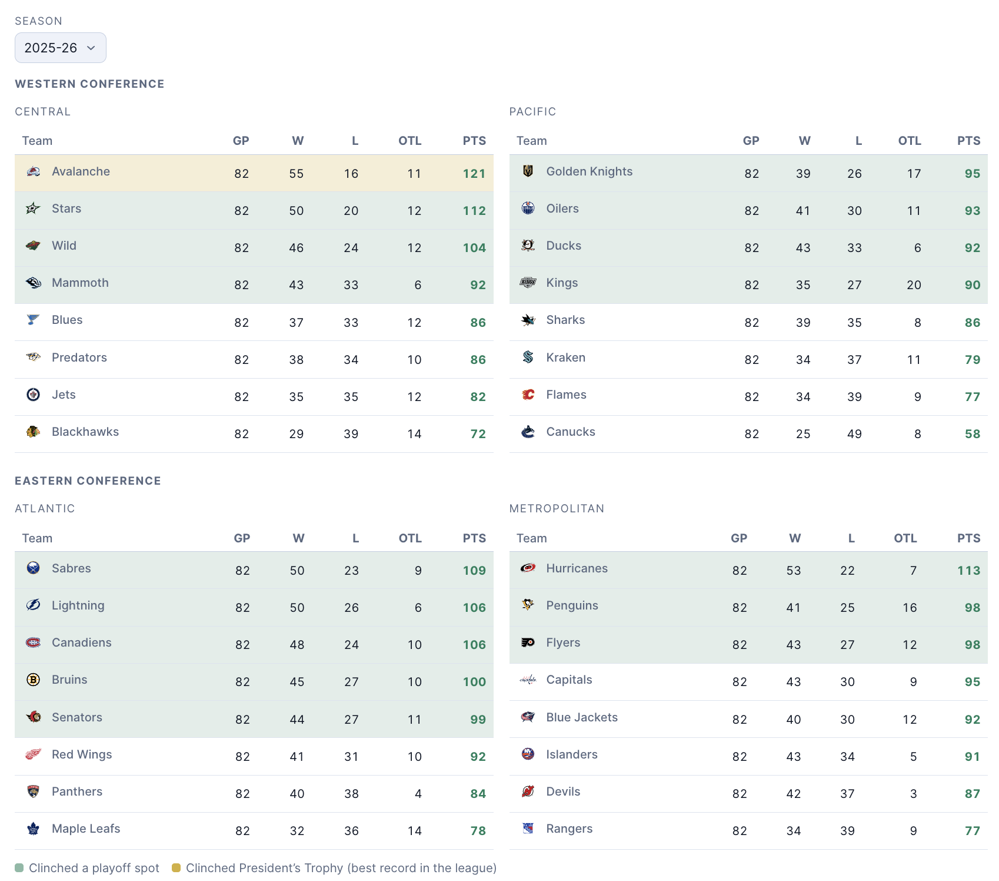

# NHL Stats Comparison 🏒

Compare any NHL skater, goalie, or team from any season since 1917-18 — using raw stats or an era-adjusted scale — on a radar chart and stats table.

**[View the live site →](https://nickgrichine.github.io/NHL-Stats-Comparison/)**


## Overview

This is a full-stack side project built to explore an interesting data problem: how do you fairly compare players across more than a century of NHL history, when the game itself — scoring rates, tracked stats, roster sizes — has changed dramatically?

- **Every player, every season.** All skaters, goalies, and teams back to the league's first year, not just a curated list.
- **Two ways to compare.** Raw range shows who actually put up the bigger number. Percentile rank instead measures each player against whoever they actually shared the ice with — that season, at that position — so a 1985 season and a 2025 season can sit on the same chart honestly. Switch between them any time.
- **Cross-era charts.** Every pick stays on its own season by default — pin McDavid's 2024-25 against Gretzky's 1985-86 on one radar — or toggle a pick to "live" to have it follow whatever season you're browsing instead.
- **Regular season, playoffs, and career totals**, with a live scoreboard for today's games and full standings for any season back to 1917-18 — grouped by conference and division, with team logos and playoff-clinch highlighting.
- **Shareable links** — the whole comparison lives in the URL.



## Tech stack

React · TypeScript · Vite · Chart.js · CSS

## How it's built

The NHL's public stats API has no CORS headers, so it can't be called directly from a browser. Instead, a scheduled GitHub Actions workflow fetches the data server-side, publishes it as compact JSON to a `data` branch, and the site loads it from the same origin — no proxy, no backend server, no API keys.

Percentiles are computed at build time per season, game type, and position group, so every comparison is ranked against the right cohort instead of a single hardcoded scale. The raw-range view instead scales each stat against that same cohort's actual min–max spread, for the times you want to see the size of a gap rather than just who's ahead.

Standings pull each season's real division and conference alignment straight from the NHL's own historical data — including realignments and one-off formats like the COVID-shortened 2020-21 season — rather than assuming today's structure applied retroactively.

## Running it locally

```bash
npm install
npm run dev            # http://localhost:5173
```

The dev server needs a local dataset:

```bash
npm run data -- --out=public/data --seasons=20242025   # one season, fast
npm run data:dev                                        # full backfill, a few minutes
```

Other scripts:

```bash
npm run typecheck
npm run lint
npm test
npm run build
```

## Data

All data comes from the NHL's public stats API (`api.nhle.com`, `api-web.nhle.com`), which is free but undocumented and unofficial. This project is not affiliated with or endorsed by the National Hockey League.
